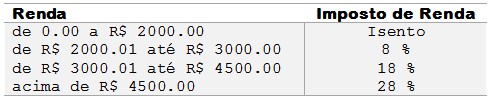

#Desafio
Há um país denominado Lilipute, todos os habitantes ficam felizes em pagar seus impostos, pois sabem que nele não existem políticos corruptos e os recursos arrecadados são utilizados em benefício da população, sem qualquer desvio. A moeda deste país é o Libs, cujo símbolo é o R$.

Você terá desafio de ler um valor com duas casas decimais, equivalente ao salário de uma pessoa de Libs. Em seguida, calcule e mostre o valor que esta pessoa deve pagar de Imposto de Renda, segundo a tabela abaixo.



Lembre que, se o salário for R$ 3002.00, a taxa que incide é de 8% apenas sobre R$ 1000.00, pois a faixa de salário que fica de R$ 0.00 até R$ 2000.00 é isenta de Imposto de Renda. No exemplo fornecido (abaixo), a taxa é de 8% sobre R$ 1000.00 + 18% sobre R$ 2.00, o que resulta em R$ 80.36 no total. O valor deve ser impresso com duas casas decimais.

#Entrada
A entrada contém apenas um valor de ponto flutuante, com duas casas decimais.

#Saída
Imprima o texto "R$" seguido de um espaço e do valor total devido de Imposto de Renda, com duas casas após o ponto. Se o valor de entrada for menor ou igual a 2000, deverá ser impressa a mensagem "Isento".

 
Exemplos de Entrada	|Exemplos de Saída
---|---
3002.00|R$ 80.36
1701.12|Isento
4520.00|R$ 355.60


```javascript
let salario = parseFloat(gets());
let taxa_imposto_renda=0
let diferenca=0
let acum = 0

if(salario >= 2000.00){
    diferenca=salario - 2000.00
    acum += 1000.00 * (8/100)
    
    if(diferenca > 0 && diferenca <= 3000.00){
        acum += diferenca * (18/100)
    }else{
        
    }
}


if (salario <= 2000.00){
    taxa_imposto_renda = 0    
}else if(salario <= 3000.00){
    taxa_imposto_renda = 8/100
}else if(salario <= 4500.00){
    taxa_imposto_renda = 18/100
}else{
    taxa_imposto_renda = 28/100
}

let resposta =''
if(taxa_imposto_renda === 0){
    resposta='Isento'
}else{
    resposta='R$ '+ (1000.00*taxa_imposto_renda+ (2.00* (18/100)))
}

console.log(resposta);
```